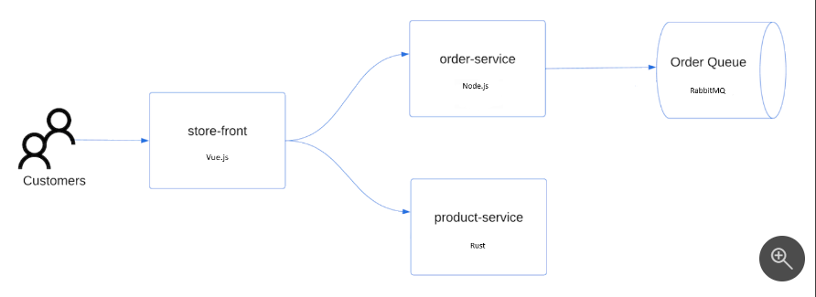

# 1. 目次

- [1. 目次](#1-目次)
- [2. クイックスタート](#2-クイックスタート)
- [3. CLI使用](#3-cli使用)
  - [3.1. リソース グループを作成する](#31-リソース-グループを作成する)
  - [3.2. AKS クラスターを作成する](#32-aks-クラスターを作成する)
  - [3.3. クラスターに接続する](#33-クラスターに接続する)
  - [3.4. アプリケーションのデプロイ](#34-アプリケーションのデプロイ)
  - [3.5. アプリケーションをテストする](#35-アプリケーションをテストする)
  - [3.6. クラスターを削除する](#36-クラスターを削除する)
- [4. ポータル使用](#4-ポータル使用)

# 2. クイックスタート

参考：[クイック スタート: Azure CLI を使用して Azure Kubernetes Service (AKS) クラスターをデプロイする](https://learn.microsoft.com/ja-jp/azure/aks/learn/quick-kubernetes-deploy-cli)

または
[クイック スタート:Azure portal を使用して Azure Kubernetes Service (AKS) クラスターをデプロイする](https://learn.microsoft.com/ja-jp/azure/aks/learn/quick-kubernetes-deploy-portal?tabs=azure-cli)

# 3. CLI使用

## 3.1. リソース グループを作成する

1. az group create コマンドを使用して、リソース グループを作成します。

    ```bash
    /mnt/d/GPT/GPTDEMO  az group create --name myResourceGroup --location eastus
    {
    "id": "/subscriptions/aeb072c2-54da-46f3-aa90-3a384d3ba8c5/resourceGroups/myResourceGroup",
    "location": "eastus",
    "managedBy": null,
    "name": "myResourceGroup",
    "properties": {
        "provisioningState": "Succeeded"
    },
    "tags": null,
    "type": "Microsoft.Resources/resourceGroups"
    }
    ```

## 3.2. AKS クラスターを作成する

次の例では、1 つのノードが含まれた myAKSCluster という名前のクラスターを作成し、システム割り当てマネージド ID を有効にします。

1. az aks create コマンドに --enable-addons monitoring パラメーターと --enable-msi-auth-for-monitoring パラメーターを指定して AKS クラスターを作成し、マネージド ID 認証 (プレビュー) を使用して Azure Monitor コンテナーの分析情報を有効にします。

    ```bash
    /mnt/d/GPT/GPTDEMO # az aks create -g myResourceGroup -n myAKSCluster --enable-managed-identity --node-count 1 --enable-addons monitoring --enable-msi-auth-for-monitoring  --generate-ssh-keys
    Argument '--enable-msi-auth-for-monitoring' is in preview and under development. Reference and support levels: https://aka.ms/CLI_refstatus
    Resource provider 'Microsoft.ContainerService' used by this operation is not registered. We are registering for you.
    Registration succeeded.
    {
    "aadProfile": null,
    "addonProfiles": {
        "omsagent": {
        "config": {
            "logAnalyticsWorkspaceResourceID": "/subscriptions/aeb072c2-54da-46f3-aa90-3a384d3ba8c5/resourceGroups/DefaultResourceGroup-EUS/providers/Microsoft.OperationalInsights/workspaces/DefaultWorkspace-aeb072c2-54da-46f3-aa90-3a384d3ba8c5-EUS",
            "useAADAuth": "true"
        },
        "enabled": true,
        "identity": null
        }
    },
    "agentPoolProfiles": [
        {
        "availabilityZones": null,
        "count": 1,
        "creationData": null,
        "currentOrchestratorVersion": "1.27.7",
        "enableAutoScaling": false,
        "enableEncryptionAtHost": false,
        "enableFips": false,
        "enableNodePublicIp": false,
        "enableUltraSsd": false,
        "gpuInstanceProfile": null,
        "hostGroupId": null,
        "kubeletConfig": null,
        "kubeletDiskType": "OS",
        "linuxOsConfig": null,
        "maxCount": null,
        "maxPods": 110,
        "minCount": null,
        "mode": "System",
        "name": "nodepool1",
        "nodeImageVersion": "AKSUbuntu-2204gen2containerd-202310.31.0",
        "nodeLabels": null,
        "nodePublicIpPrefixId": null,
        "nodeTaints": null,
        "orchestratorVersion": "1.27.7",
        "osDiskSizeGb": 128,
        "osDiskType": "Managed",
        "osSku": "Ubuntu",
        "osType": "Linux",
        "podSubnetId": null,
        "powerState": {
            "code": "Running"
        },
        "provisioningState": "Succeeded",
        "proximityPlacementGroupId": null,
        "scaleDownMode": null,
        "scaleSetEvictionPolicy": null,
        "scaleSetPriority": null,
        "spotMaxPrice": null,
        "tags": null,
        "type": "VirtualMachineScaleSets",
        "upgradeSettings": {
            "drainTimeoutInMinutes": null,
            "maxSurge": null
        },
        "vmSize": "Standard_DS2_v2",
        "vnetSubnetId": null,
        "workloadRuntime": null
        }
    ],
    "apiServerAccessProfile": null,
    "autoScalerProfile": null,
    "autoUpgradeProfile": {
        "nodeOsUpgradeChannel": "NodeImage",
        "upgradeChannel": null
    },
    "azureMonitorProfile": null,
    "azurePortalFqdn": "myaksclust-myresourcegroup-aeb072-sfjtned3.portal.hcp.eastus.azmk8s.io",
    "currentKubernetesVersion": "1.27.7",
    "disableLocalAccounts": false,
    "diskEncryptionSetId": null,
    "dnsPrefix": "myAKSClust-myResourceGroup-aeb072",
    "enablePodSecurityPolicy": null,
    "enableRbac": true,
    "extendedLocation": null,
    "fqdn": "myaksclust-myresourcegroup-aeb072-sfjtned3.hcp.eastus.azmk8s.io",
    "fqdnSubdomain": null,
    "httpProxyConfig": null,
    "id": "/subscriptions/aeb072c2-54da-46f3-aa90-3a384d3ba8c5/resourcegroups/myResourceGroup/providers/Microsoft.ContainerService/managedClusters/myAKSCluster",
    "identity": {
        "delegatedResources": null,
        "principalId": "d642fe65-dff3-4aa0-8273-8c537be02fae",
        "tenantId": "7a0c0f98-1305-4657-a187-f44dd5bc5350",
        "type": "SystemAssigned",
        "userAssignedIdentities": null
    },
    "identityProfile": {
        "kubeletidentity": {
        "clientId": "5eb6dfdc-5510-48a7-82ec-8da660bf22ef",
        "objectId": "ddaf51f8-0f02-48f5-ac6b-2a4292a1ae98",
        "resourceId": "/subscriptions/aeb072c2-54da-46f3-aa90-3a384d3ba8c5/resourcegroups/MC_myResourceGroup_myAKSCluster_eastus/providers/Microsoft.ManagedIdentity/userAssignedIdentities/myAKSCluster-agentpool"
        }
    },
    "kubernetesVersion": "1.27.7",
    "linuxProfile": {
        "adminUsername": "azureuser",
        "ssh": {
        "publicKeys": [
            {
            "keyData": "ssh-rsa AAAAB3NzaC1yc2EAAAADAQABAAABgQCPiP32XmUsfDfA8PIWOSAndZsHtItutLN5pTmfssCBt2QyVOF2L1eYMFUAIL8c1hMGMDs3FEja5+wfKl9XrMgAteubPzWIUmf0kcqd0X3Rw4IPH+unVGJPIFStNMwk6dfSCU3qyQ6FOstrrG3EFU+fx7DIYjvDVYL7yQc4UaSQ/4GLSzl7EhshGYesV3Wd+OfTpIMKrg9kMf+qhKWyjZJSLphrqXIqMxU2f2ZqiGeB+IiKxaeiFWjqFaH2L2KfU5WgV3k//IR+N4kOSd7eysBNyPshTrYaGjc5EaUwZiH1ExUQJ55R+SCJa0CN8VRr5ns5etFpwOVKTV2NuVqrAX9/LjmyqDsJCjgL7R4jCDUHCwc6LZ7mwiG1Yzf4P+wpTMFb2TiZ300+GbGzUdJCkPFf3X8EHvcHySeqgyB0ds5nBZExEU1YPhESdgOopt8rAb++ZtfpPeGGQ6MKsG4vExKYpALFoXkIo9kOXiqLeSij0gtrqPY/pl0Xaj0v9cCFjGE= root@YutoKawamura\n"
            }
        ]
        }
    },
    "location": "eastus",
    "maxAgentPools": 100,
    "name": "myAKSCluster",
    "networkProfile": {
        "dnsServiceIp": "10.0.0.10",
        "ipFamilies": [
        "IPv4"
        ],
        "loadBalancerProfile": {
        "allocatedOutboundPorts": null,
        "effectiveOutboundIPs": [
            {
            "id": "/subscriptions/aeb072c2-54da-46f3-aa90-3a384d3ba8c5/resourceGroups/MC_myResourceGroup_myAKSCluster_eastus/providers/Microsoft.Network/publicIPAddresses/b231d1db-fe31-4f7e-9280-de087c927b8b",
            "resourceGroup": "MC_myResourceGroup_myAKSCluster_eastus"
            }
        ],
        "enableMultipleStandardLoadBalancers": null,
        "idleTimeoutInMinutes": null,
        "managedOutboundIPs": {
            "count": 1,
            "countIpv6": null
        },
        "outboundIPs": null,
        "outboundIpPrefixes": null
        },
        "loadBalancerSku": "Standard",
        "natGatewayProfile": null,
        "networkDataplane": null,
        "networkMode": null,
        "networkPlugin": "kubenet",
        "networkPluginMode": null,
        "networkPolicy": null,
        "outboundType": "loadBalancer",
        "podCidr": "10.244.0.0/16",
        "podCidrs": [
        "10.244.0.0/16"
        ],
        "serviceCidr": "10.0.0.0/16",
        "serviceCidrs": [
        "10.0.0.0/16"
        ]
    },
    "nodeResourceGroup": "MC_myResourceGroup_myAKSCluster_eastus",
    "oidcIssuerProfile": {
        "enabled": false,
        "issuerUrl": null
    },
    "podIdentityProfile": null,
    "powerState": {
        "code": "Running"
    },
    "privateFqdn": null,
    "privateLinkResources": null,
    "provisioningState": "Succeeded",
    "publicNetworkAccess": null,
    "resourceGroup": "myResourceGroup",
    "securityProfile": {
        "azureKeyVaultKms": null,
        "defender": null,
        "imageCleaner": null,
        "workloadIdentity": null
    },
    "servicePrincipalProfile": {
        "clientId": "msi",
        "secret": null
    },
    "sku": {
        "name": "Base",
        "tier": "Free"
    },
    "storageProfile": {
        "blobCsiDriver": null,
        "diskCsiDriver": {
        "enabled": true
        },
        "fileCsiDriver": {
        "enabled": true
        },
        "snapshotController": {
        "enabled": true
        }
    },
    "supportPlan": "KubernetesOfficial",
    "systemData": null,
    "tags": null,
    "type": "Microsoft.ContainerService/ManagedClusters",
    "upgradeSettings": null,
    "windowsProfile": null,
    "workloadAutoScalerProfile": {
        "keda": null,
        "verticalPodAutoscaler": null
    }
    }
    ```

## 3.3. クラスターに接続する

1. az aks install-cli コマンドを使用して kubectl をローカルにインストールします。

    ```bash
    az aks install-cli
    ```

1. az aks get-credentials コマンドを使用して、Kubernetes クラスターに接続するように kubectl を構成します。 このコマンドは、資格情報をダウンロードし、それを使用するように Kubernetes CLI を構成します。

    ```bash
    az aks get-credentials --resource-group myResourceGroup --name myAKSCluster
    ```

1. kubectl get コマンドを使用して、ご利用のクラスターへの接続を確認します。 このコマンドでは、クラスター ノードの一覧が返されます。

    ```bash
    kubectl get nodes
    ```

    ```bash
    /mnt/d/GPT/GPTDEMO # kubectl get nodes
    NAME                                STATUS   ROLES   AGE   VERSION
    aks-nodepool1-31996413-vmss000000   Ready    agent   25m   v1.27.7
    ```

## 3.4. アプリケーションのデプロイ

アプリケーションをデプロイするには、マニフェスト ファイルを使用して、 AKS Microsoft Store アプリケーションの実行に必要なすべてのオブジェクトを作成します。 Kubernetes のマニフェスト ファイルでは、どのコンテナー イメージを実行するかなど、クラスターの望ましい状態を定義します。 マニフェストには、次の Kubernetes のデプロイとサービスが含まれています：



1. aks-store-quickstart.yaml という名前のファイルを作成し、そこに次のマニフェストをコピーします。

    ```bash
    apiVersion: apps/v1
    kind: Deployment
    metadata:
    name: rabbitmq
    spec:
    replicas: 1
    selector:
        matchLabels:
        app: rabbitmq
    template:
        metadata:
        labels:
            app: rabbitmq
        spec:
        nodeSelector:
            "kubernetes.io/os": linux
        containers:
        - name: rabbitmq
            image: mcr.microsoft.com/mirror/docker/library/rabbitmq:3.10-management-alpine
            ports:
            - containerPort: 5672
            name: rabbitmq-amqp
            - containerPort: 15672
            name: rabbitmq-http
            env:
            - name: RABBITMQ_DEFAULT_USER
            value: "username"
            - name: RABBITMQ_DEFAULT_PASS
            value: "password"
            resources:
            requests:
                cpu: 10m
                memory: 128Mi
            limits:
                cpu: 250m
                memory: 256Mi
            volumeMounts:
            - name: rabbitmq-enabled-plugins
            mountPath: /etc/rabbitmq/enabled_plugins
            subPath: enabled_plugins
        volumes:
        - name: rabbitmq-enabled-plugins
            configMap:
            name: rabbitmq-enabled-plugins
            items:
            - key: rabbitmq_enabled_plugins
                path: enabled_plugins
    ---
    apiVersion: v1
    data:
    rabbitmq_enabled_plugins: |
        [rabbitmq_management,rabbitmq_prometheus,rabbitmq_amqp1_0].
    kind: ConfigMap
    metadata:
    name: rabbitmq-enabled-plugins            
    ---
    apiVersion: v1
    kind: Service
    metadata:
    name: rabbitmq
    spec:
    selector:
        app: rabbitmq
    ports:
        - name: rabbitmq-amqp
        port: 5672
        targetPort: 5672
        - name: rabbitmq-http
        port: 15672
        targetPort: 15672
    type: ClusterIP
    ---
    apiVersion: apps/v1
    kind: Deployment
    metadata:
    name: order-service
    spec:
    replicas: 1
    selector:
        matchLabels:
        app: order-service
    template:
        metadata:
        labels:
            app: order-service
        spec:
        nodeSelector:
            "kubernetes.io/os": linux
        containers:
        - name: order-service
            image: ghcr.io/azure-samples/aks-store-demo/order-service:latest
            ports:
            - containerPort: 3000
            env:
            - name: ORDER_QUEUE_HOSTNAME
            value: "rabbitmq"
            - name: ORDER_QUEUE_PORT
            value: "5672"
            - name: ORDER_QUEUE_USERNAME
            value: "username"
            - name: ORDER_QUEUE_PASSWORD
            value: "password"
            - name: ORDER_QUEUE_NAME
            value: "orders"
            - name: FASTIFY_ADDRESS
            value: "0.0.0.0"
            resources:
            requests:
                cpu: 1m
                memory: 50Mi
            limits:
                cpu: 75m
                memory: 128Mi
        initContainers:
        - name: wait-for-rabbitmq
            image: busybox
            command: ['sh', '-c', 'until nc -zv rabbitmq 5672; do echo waiting for rabbitmq; sleep 2; done;']
            resources:
            requests:
                cpu: 1m
                memory: 50Mi
            limits:
                cpu: 75m
                memory: 128Mi    
    ---
    apiVersion: v1
    kind: Service
    metadata:
    name: order-service
    spec:
    type: ClusterIP
    ports:
    - name: http
        port: 3000
        targetPort: 3000
    selector:
        app: order-service
    ---
    apiVersion: apps/v1
    kind: Deployment
    metadata:
    name: product-service
    spec:
    replicas: 1
    selector:
        matchLabels:
        app: product-service
    template:
        metadata:
        labels:
            app: product-service
        spec:
        nodeSelector:
            "kubernetes.io/os": linux
        containers:
        - name: product-service
            image: ghcr.io/azure-samples/aks-store-demo/product-service:latest
            ports:
            - containerPort: 3002
            resources:
            requests:
                cpu: 1m
                memory: 1Mi
            limits:
                cpu: 1m
                memory: 7Mi
    ---
    apiVersion: v1
    kind: Service
    metadata:
    name: product-service
    spec:
    type: ClusterIP
    ports:
    - name: http
        port: 3002
        targetPort: 3002
    selector:
        app: product-service
    ---
    apiVersion: apps/v1
    kind: Deployment
    metadata:
    name: store-front
    spec:
    replicas: 1
    selector:
        matchLabels:
        app: store-front
    template:
        metadata:
        labels:
            app: store-front
        spec:
        nodeSelector:
            "kubernetes.io/os": linux
        containers:
        - name: store-front
            image: ghcr.io/azure-samples/aks-store-demo/store-front:latest
            ports:
            - containerPort: 8080
            name: store-front
            env: 
            - name: VUE_APP_ORDER_SERVICE_URL
            value: "http://order-service:3000/"
            - name: VUE_APP_PRODUCT_SERVICE_URL
            value: "http://product-service:3002/"
            resources:
            requests:
                cpu: 1m
                memory: 200Mi
            limits:
                cpu: 1000m
                memory: 512Mi
    ---
    apiVersion: v1
    kind: Service
    metadata:
    name: store-front
    spec:
    ports:
    - port: 80
        targetPort: 8080
    selector:
        app: store-front
    type: LoadBalancer
    ```

1. kubectl apply コマンドを使用してアプリケーションをデプロイし、ご利用の YAML マニフェストの名前を指定します。

    ```bash
    kubectl apply -f aks-store-quickstart.yaml
    ```

##  3.5. アプリケーションをテストする

アプリケーションが実行されると、Kubernetes サービスによってアプリケーション フロント エンドがインターネットに公開されます。 このプロセスが完了するまでに数分かかることがあります。

1. kubectl get pods コマンドを使用して、デプロイされたポッドの状態を確認します。 続行する前に、すべてのポッドを Running にします。

2. ストア フロント アプリケーションのパブリック IP アドレスを確認します。 kubectl get service コマンドと --watch 引数を使用して、進行状況を監視します。

    ```bash
    kubectl get service store-front --watch
    ```

1. EXTERNAL-IP アドレスが保留中から実際のパブリック IP アドレスに変わったら、CTRL-C を使用して kubectl ウォッチ プロセスを停止します。
次の出力例は、サービスに割り当てられている有効なパブリック IP アドレスを示しています。

    ```bash
    /mnt/d/GPT/GPTDEMO/k8s # kubectl get service store-front --watch
    NAME          TYPE           CLUSTER-IP    EXTERNAL-IP     PORT(S)        AGE
    store-front   LoadBalancer   10.0.247.18   20.253.59.246   80:31056/TCP   15s
    ```

4. サービスの外部 IP アドレスに対して Web ブラウザーを開き、Azure Store アプリの動作を確認します。
アクセス：http://20.253.59.246/

## 3.6. クラスターを削除する
この後のチュートリアルを実行しない場合は、Azure の課金を回避するために不要なリソースをクリーンアップします。

1. az group delete コマンドを使用して、リソース グループ、コンテナー サービス、すべての関連リソースを削除します。

    ```bash
    az group delete --name myResourceGroup --yes --no-wait
    ```

# 4. ポータル使用

